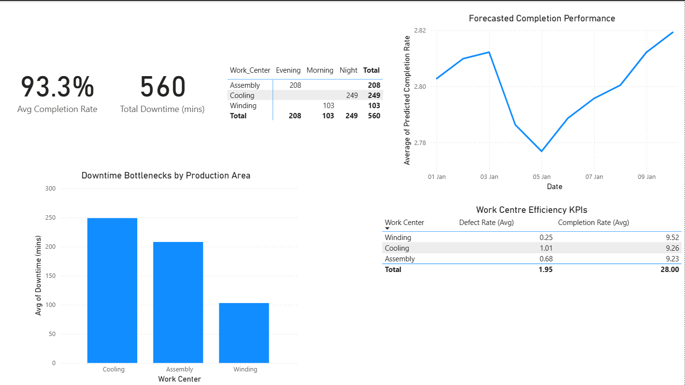

# Magnet Production Throughput Analytics

A data-driven analytics project analysing manufacturing throughput, downtime, and quality in a superconducting magnet production process.

The project simulates operational manufacturing data, analyses key performance indicators (KPIs), and applies predictive modelling to identify potential production bottlenecks and support data-driven decision-making.

---

## Features

• Analyses operational manufacturing data to identify throughput bottlenecks  
• Builds manufacturing KPIs including completion rate, defect rate, and downtime  
• Implements a regression model to estimate throughput performance  
• Generates an interactive Power BI dashboard for operational decision-support  

---

## Technologies Used

Python  
Pandas  
NumPy  
Matplotlib  
SQL  
Power BI  
Scikit-learn  

---

## Example Output

---

## Why I Built This

I built this project to strengthen my data analysis and Python skills by applying analytics techniques to a realistic manufacturing scenario. The goal was to explore how operational data can be used to identify performance bottlenecks and support decision-making in complex engineering environments.
